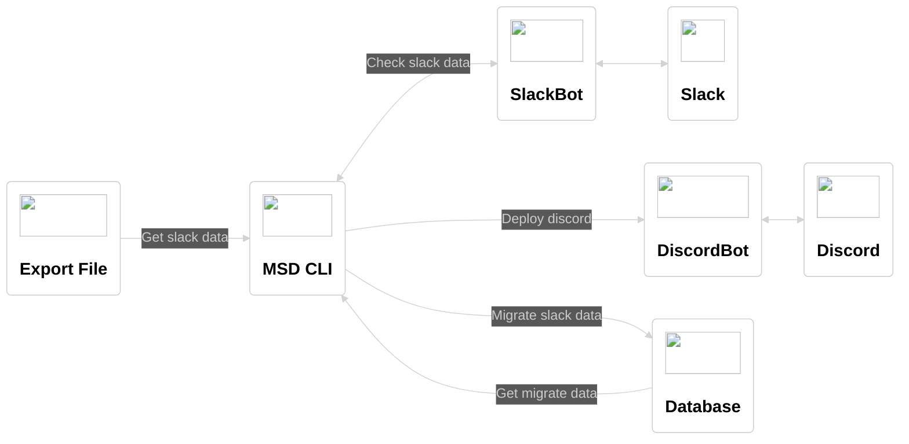

# MSD CLI


SlackからDiscordに移行するためのnode.js製のCLI  
MSDは(Migrate from Slack to Discord)の略称  

> **Warning**  
> **このCLIでは、Privateチャンネルの移行は基本的にできません**  
> このCLIは個人用途に簡易的に作られているため、十分なテストがされていません  
> 将来的にSlackやDiscordのAPIの仕様変更によって、使用できなくなる可能性があります  
> 動作の保証ができないので、利用する際は自己責任でお願いします  

仕組みとしては、SlackのエクスポートデータをDiscordに出力できるデータに変換し、DiscordBot経由でチャンネルの作成とメッセージの出力を行うことで移行を実現します  



## ドキュメント

- [移行可能な項目と移行できない項目](./docs/migration.md)
- [仕様](./docs/specification.md)
- [初回設定](./docs/init.md)
- [参考リンク](./docs/reference.md)

## 使用方法

[初回設定](./docs/initial-setting.md)でBotなどの設定を完了後、下記のコマンドを順次実行して移行します  

```zsh
# 作業ディレクトリ初期化、移行用のSQLiteファイル作成を行う
npm run init

# チャンネルをデプロイする
npm run migrate:channel
npm run deploy:channel

# ユーザーの画像をホストするためのチャンネルをデプロイする
npm run migrate:user
npm run deploy:user

# メッセージをデプロイする
npm run migrate:message
npm run deploy:message
```

移行した内容を元に戻す場合は、下記のコマンドを実行することでリセットできます  

```zsh
npm run destroy
# or
npm run destroy:user
npm run destroy:message
npm run destroy:channel
```

移行完了後はBotは不要になるため、念のため削除しておいた方が良いと思います  
ユーザーの画像をホストするためのチャンネル`#mds-user`は、Discordの仕様上、[CDNにアップロードされたファイルを消えない](https://support.discord.com/hc/en-us/community/posts/360061593771-Privacy-for-CDN-attachements))ようなので、削除しても問題ありません  

## 主な既知の問題

### [移行速度の高速化とDBの変更](https://github.com/revoltage-inc/cli-mds/issues/37)

現在はDBにSQLiteを利用しているため、同時書き込みができない制限で、直列処理でチャンネルにメッセージのデプロイをしているため、移行速度が遅いです  
同時書き込みができるDBに移行し、並列処理で複数のチャンネルに同時にメッセージのデプロイをできるようにしたいです  

### [Embedの制限を超える文字数のメッセージへの対応](https://github.com/revoltage-inc/cli-mds/issues/13)

DiscordのEmbed(埋め込みメッセージ)の仕様上、1024文字より長いメッセージは送れない制限があります  
現在は暫定対応として、メッセージを1024文字以内に丸めていますが、メッセージを分割するなどで送信できるように対応したいです  

### [Discordの最大アップロードサイズを超えるファイルへの対応](https://github.com/revoltage-inc/cli-mds/issues/38)

Discordのアップロードファイルの制限値がサーバーブーストしても最大100MBなので、  
現在最大アップロードサイズを超えるファイルはエクスポートデータのファイルURLを添付するだけになっているので、  
最大アップロードサイズを超えるファイルがある場合は、警告を出力し、可能ならばオプションで別ストレージサービスへアップロードを可能にしたいです  

## License

[MIT](https://opensource.org/licenses/MIT)
