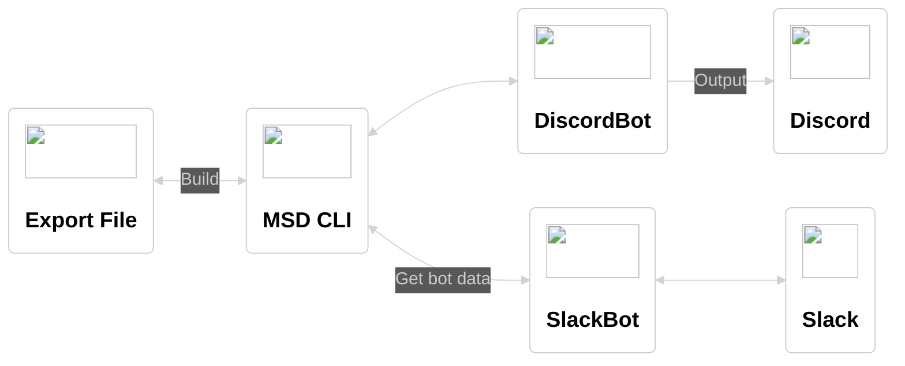

# MSD CLI


SlackからDiscordにチャンネルのメッセージを移行するためのnode.js製のCLI  
MSDは(Migrate from Slack to Discord)の略称  

> **Warning**  
> このCLIは簡易的に作ったもののため、十分にテストされていません  
> 将来的にSlackやDiscordのAPIの仕様変更によって、使用できなくなる可能性があります  
> 動作の保証ができないので、利用する際には自己責任でお願いします  

SlackのエクスポートデータをDiscordに移行できるデータに変換し、DiscordBotがチャンネルの作成とメッセージの出力を行います  



## ドキュメント

- [移行できるものと移行しないもの](./docs/migration.md)
- [初回設定](./docs/init.md)
- [仕様](./docs/specification.md)
- [参考リンク](./docs/reference.md)

## 使用方法

[初回設定](./docs/initial-setting.md)を設定完了後、下記のコマンドを順次実行する  

```zsh
# チャンネル、ユーザー、メッセージのデータファイルを作成する
npm run build
# or
npm run init
npm run build:user
npm run build:message
npm run deploy:channel

# チャンネル、メッセージを作成する
npm run deploy
# or
npm run deploy:channel
npm run deploy:message
```

Discordへメッセージのデータの移行に失敗した場合は、それぞれ下記のコマンドを実行することでリセットできる  

```zsh
# チャンネル、メッセージを削除する
npm run destroy
# or
npm run destroy:channel
npm run destroy:message
```

## 既知の問題

### SlackBotのBotIdが照合できない

エクスポートデータの`users.json`のBotIdとメッセージに記載されているBotIdが違います  
[bots.info](https://api.slack.com/methods/bots.info)や[users.info](https://api.slack.com/methods/users.info)でどちらのBotIdで取得しても、updatedが1時間ほど違うだけでそれ以外の情報は同じです  
BotIdは全てのボットが存在するすべてのワークスペースで一意だそうですが、BotIdがなぜか2つあるようで理由は不明です  
そのため、エクスポートデータだけではBotIdが照合できないので、照合するためにSlackBotを利用しています  

### @types/nodeにfsPromise.constantsが無い

下記のissueで修正反映待ち中  
修正反映まではfs.constantsで代用  

https://github.com/DefinitelyTyped/DefinitelyTyped/pull/61690

### 並列化・非同期化

for文で直列でやってる処理が多いので、Promise.allなどで並列化できる箇所は並列化したい  
一部同期関数で処理していて、ブロッキング操作になっている箇所があるので、非同期関数に置き換えたい  

## License

[MIT](https://opensource.org/licenses/MIT)
