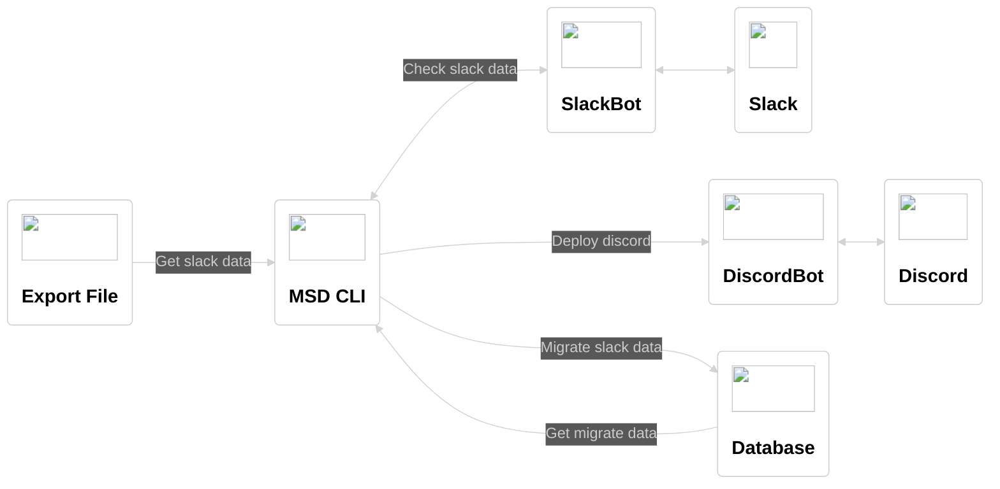

# 図の一覧

なぜかMermaid記法の画像がGitHubだと表示されないので、VSCodeのプレビューのスクリーンショット画像で代用中

## アーキテクチャ

```mermaid
%%{init:{'theme':'dark','themeCSS':" .node rect {fill:#fff;} label {font-size:20px; font-weight:bold; color:#000} .output {font-size:36px;} img {background-color:#fff; weight:50px; height:50px;}"}}%%
flowchart LR
  msd(<img src='./img/msd.png' /><br><label>MSD CLI</label>)
  slack(<img src='./img/slack.png' /><br><label>Slack</label>)
  discord(<img src='./img/discord.png' /><br><label>Discord</label>)
  slackBot(<img src='./img/slack-bot.png' /><br><label>SlackBot</label>)
  discordBot(<img src='./img/discord-bot.png' /><br><label>DiscordBot</label>)
  exportFile(<img src='./img/slack-file.png' /><br><label>Export File</label>)
  database(<img src='./img/database.png' /><br><label>Database</label>)

  msd ---> |Deploy discord| discordBot
  discordBot <--> discord
  msd <--> |Check slack data| slackBot
  msd ---> |Migrate slack data| database
  database --> |Get migrate data| msd
  slackBot <--> slack
  exportFile --> |Get slack data| msd
```
